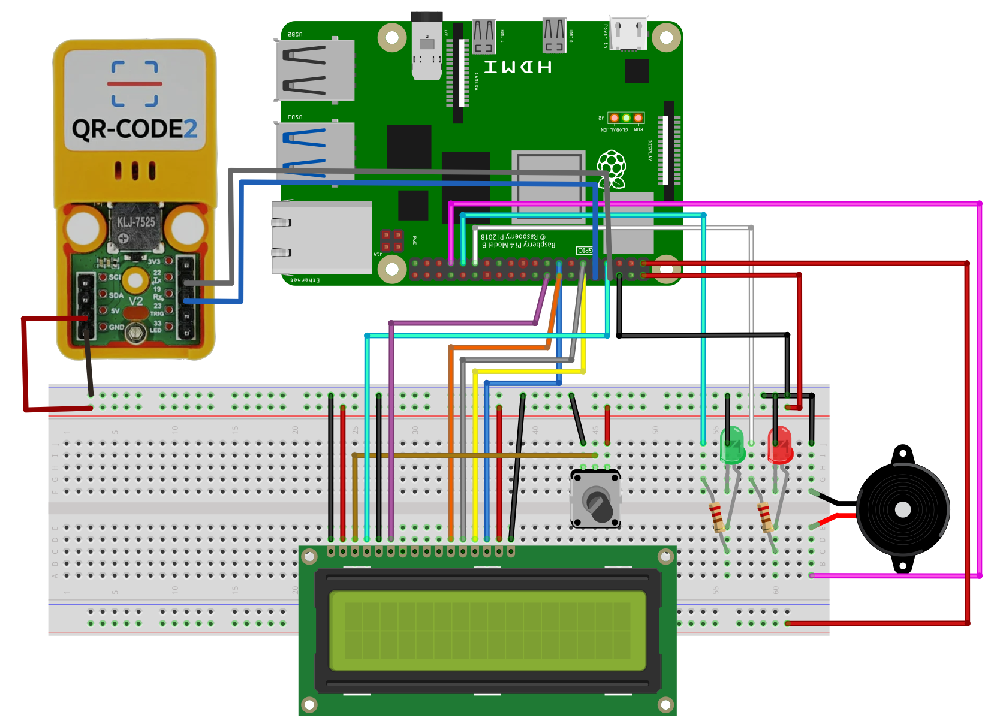
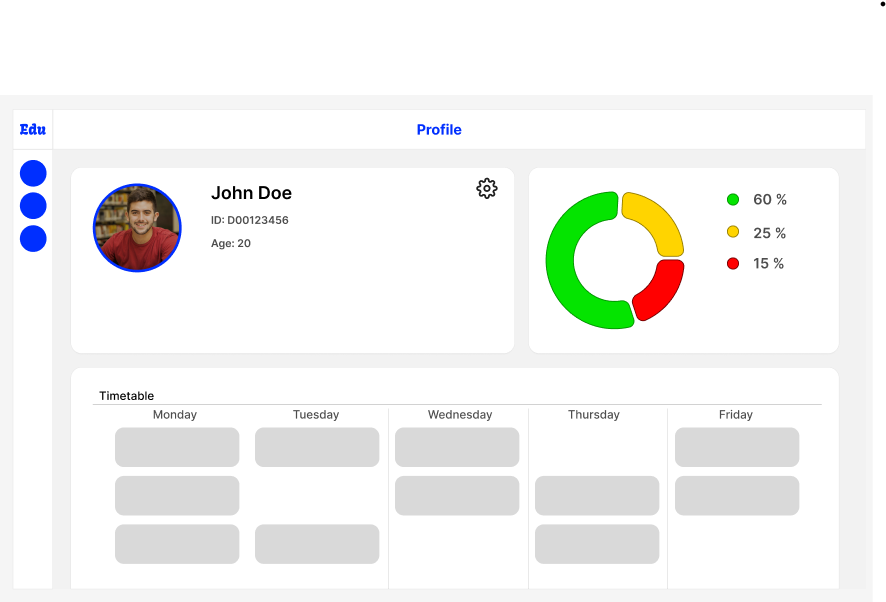
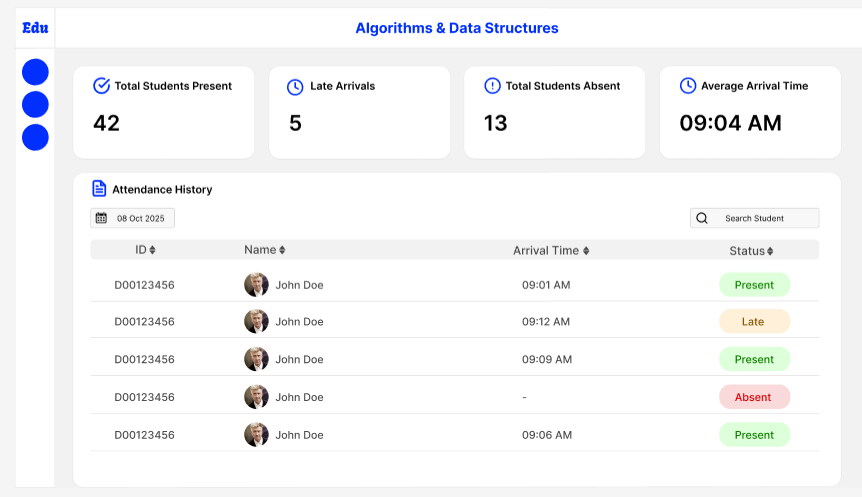
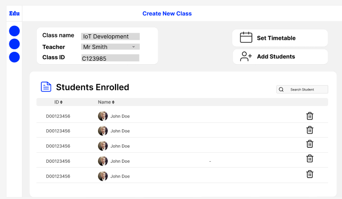

# Edusense Project
https://github.com/HenriqueJoanoni/edusense-project

## Table of Contents
1. [Introduction](#introduction) 
2. [Hardware](#iot-layer)
3. [Data, Data Storage, and Data Processing](#data-data-storage-and-data-processing)
4. [Security and Privacy](#security-and-privacy)
5. [The UI, User, and Testing](#the-user-ui-and-testing)


## Introduction
This project is a smart attendance management system designed to streamline student attendance tracking. It integrates
a barcode-based identification system with a modern web platform to ensure accuracy and ease of use.

`Backend`: Built with `Laravel`, providing secure APIs, data management, and business logic.

`Frontend`: Developed in `React`, offering an intuitive and responsive admin panel for managing students, classes, and
attendance records.

`IoT Layer`: Powered by `Python`, running on barcode-enabled scanning device to capture student card data and send it
directly to
the system in real-time.

The system allows administrators and teachers to efficiently manage attendance records while reducing manual errors and
improving reliability through automation.

<h2 align="center">Technologies Used</h2>
<p align="center">
  <a href="https://laravel.com/"></a>
  <a href="https://react.dev/"></a>
  <a href="https://www.python.org/"></a>
  <a href="https://www.raspberrypi.com/"></a>
</p>

## How to run this project

### Backend (Laravel)

- After cloning this repository, run `composer install` to install the dependencies.
- Create a `.env` file and set the environment variables as per `.env.example`.
- Run `php artisan migrate` to create the database tables.
- Run `php artisan db:seed` to seed the database with sample data.
- Run `php artisan serve` to start the server.

### Frontend (React)

- After cloning this repository, run `yarn install` to install the dependencies.
- Run `yarn start` to start the development server.

- Open `http://localhost:3000/` in your browser.

## IoT Layer

### Hardware List:

- 1x Raspberry Pi 5
- 1x Buzzer
- 1x Red LED
- 1x Green LED
- 2x 330Ω Resistors
- 1x BreadBoard
- 1x 10K Potentiometer
- 1x 16x2 LCD Display (HD44780 compatible)
- 1x Barcode Scanner Module (e.g., ATOMIC 2D Barcode Scanner Module)
- Jumper Wires
- Power Supply for Raspberry Pi
- MicroSD Card with Raspberry Pi OS installed
- Ethernet Cable (for internet connection)

### Hardware Connections:

| Component            | GPIO Pins          | Raspberry Pi 5 (physical pins) | Notes                                                                                                   |
|----------------------|-----------------------------|---------------------------------|---------------------------------------------------------------------------------------------------------|
| LCD pin 1 (GND)      | GND                         | Any Pi ground rail              | -                                                                                                       |
| LCD pin 2 (VCC / 5V) | +5V rail                    | Physical Pin 2 or 4             | The LCD backlight needs 5V                                                                              |
| LCD pin 3      | Potentiometer middle        | -                               | contrast adjust                                                                                         |
| LCD RS               | GPIO4                       | Physical 7              | -                                                                                                       |
| LCD EN               | GPIO24                      | Physical 18            | -                                                                                                       |
| LCD D4               | GPIO23                      | Physical 16            | -                                                                                                       |
| LCD D5               | GPIO17                      | Physical 11            | -                                                                                                       |
| LCD D6               | GPIO18                      | Physical 12            | -                                                                                                       |
| LCD D7               | GPIO22                      | Physical 15            | -                                                                                                       |
| LCD LED+             | +5V rail                    | -                               | backlight                                                                                               |
| LCD LED–             | GND                         | -                               | backlight ground                                                                                        |
| Red LED    | GPIO5                       | Physical 29             | through resistor (e.g. 330 Ω) to LED                                                                    |
| Green LED | GPIO6                       | Physical 31             | through resistor                                                                                        |
| Buzzer      | GPIO13                      | Physical 33            | -                                               |
| Scanner VCC          | 5V or 3.3V (check spec)     | e.g. 5V rail                    | Many modules use 3.3V, but the ATOMIC base spec suggests 5V supply possible |
| Scanner GND          | GND                         | ground rail                     | common ground                                                                                           |
| Scanner TX → Pi RX   | Pi GPIO15 (UART RX) | Physical Pin 10                 | connect scanner TX to Pi RX                                                                             |
| Scanner RX → Pi TX   | Pi GPIO14 (UART TX) | Physical Pin 8                  | connect scanner RX to Pi TX                                                                             |

- Raspberry Pi 5 will be connected to the internet via Ethernet
- Raspberry Pi will be powered using the official 27w power adapter

### Fritzing Diagram



### Python Virtual Enviroment
In Hardware folder
```
python -m venv venv
source venv/bin/activate
```
pip installs
```
pip install gpiozero adafruit-blinka adafruit-circuitpython-charlcd lgpio
```


## Data, Data Storage and Data Processing

This section describes what data the device sensors will gather, how that data is stored, and how it is processed in the
Edusense automatic attendance system (Laravel API backend, React frontend, Python sensor clients). The deployment target
is AWS with PubNub used for real-time event streaming to the frontend.

1) Sensors and data captured

- Primary sensors/devices
    - Barcode/QR scanner
        - What is captured: code value, scanner device id, timestamp.
        - How it works: The scanner will send decoded code via USB keyboard emulation, camera-based scanners in Python 
          to decode frames and emit an event.
        - Typical frequency: event-driven on scan. Can scan several codes per second; again for attendance we expect one
          scan per student.
    - Optional peripheral sensors
        - Camera: for optional face capture (store face embeddings or image hashes only if consented). Frequency: on
          demand (when a reader event occurs) or continuous at a low frame rate if used for verification.

- Third-party APIs
    - PubNub: used as a real-time pub/sub channel between edge devices/backend and the frontend. Devices publish events
      to backend or directly to PubNub depending on architecture. PubNub is not used to store canonical records — it is
      a transport for realtime updates.
    - Optional Student Information Systems (SIS) or LMS APIs: if integrating with a college SIS (e.g., to sync student
      lists or class schedules), those APIs are polled/synced via scheduled sync jobs. Frequency configurable (
      hourly/daily).
    - If camera-based face recognition uses cloud or third-party services (e.g., AWS Rekognition), these integrations
      must be explicitly configured and consented; details of that API (request/response fields) must be documented and
      GDPR/consent rules followed.

2) Data model and persistent storage
   Primary choices

- Primary relational database: MySQL for canonical attendance data and user records. Laravel
  Eloquent models map to these tables.

Canonical relational schema (MySQL)

### students
- id — BIGINT UNSIGNED, AUTO_INCREMENT, PRIMARY KEY
- student_name — VARCHAR(125)
- registration — VARCHAR(125)
- rfid_code — VARCHAR(125)
- qr_code — VARCHAR(125)
- course_id — INT
- user_id — INT
- FOREIGN KEY (course_id) → courses(id)
- FOREIGN KEY (user_id) → users(id)

### devices
- id — BIGINT UNSIGNED, AUTO_INCREMENT, PRIMARY KEY
- device_uuid — VARCHAR(255), UNIQUE
- label — VARCHAR(255)
- location — VARCHAR(255)
- last_seen_at — DATETIME, NULL
- config — JSON, NULL
- created_at — TIMESTAMP, NULL
- updated_at — TIMESTAMP, NULL

### classes
- id — BIGINT UNSIGNED, AUTO_INCREMENT, PRIMARY KEY
- year — INT
- semester — INT
- course_id — BIGINT UNSIGNED
- FOREIGN KEY (course_id) → courses(id)

### attendances
- id — BIGINT UNSIGNED, AUTO_INCREMENT, PRIMARY KEY
- year — INT
- semester — INT
- course_id — BIGINT UNSIGNED
- FOREIGN KEY (course_id) → courses(id)

### sensor_events
- id — BIGINT UNSIGNED, AUTO_INCREMENT, PRIMARY KEY
- device_id — BIGINT UNSIGNED
- sensor_type — VARCHAR(50)
- payload — JSON
- event_timestamp — DATETIME
- received_at — DATETIME
- processed — BOOLEAN, DEFAULT FALSE
- created_at — TIMESTAMP, NULL
- updated_at — TIMESTAMP, NULL
- FOREIGN KEY (device_id) → devices(id)

### device_heartbeats
- id — BIGINT UNSIGNED, AUTO_INCREMENT, PRIMARY KEY
- device_id — BIGINT UNSIGNED
- ip — VARCHAR(45)
- firmware_version — VARCHAR(50)
- seen_at — DATETIME
- FOREIGN KEY (device_id) → devices(id)

Example JSON shape for a sensor_events.payload
```json{
"uid": "04A3F2C7",
"type": "mifare-classic",
"rssi": -58,
"raw_hex": "0x04A3F2C7",
"reader_port": 1,
"image_url": null
}
```
Reasoning: Keeping attendances normalized (with student_id and class_id) allows efficient relational queries and
reporting. Raw events may be retained in S3 or a sensor_events table for debugging/auditing.

3) Sample queries (MySQL)

- 1) Mark attendance (insert)
       INSERT INTO `attendances` (`student_id`, `class_id`, `device_id`, `sensor_type`, `sensor_event_id`,
       `recorded_at`, `source_timestamp`, `status`, `metadata`, `created_at`, `updated_at`)
       VALUES (1234, 5678, 10, 'rfid', 98765, NOW(), '2025-10-25 08:05:32', 'present', '{"rssi": -52}', NOW(), NOW());

- 2) Get a student's attendance for a course between dates
       SELECT ar.*, c.course_code, s.first_name, s.last_name
       FROM `attendances` ar
       JOIN `classes` c ON ar.class_id = c.id
       JOIN `students` s ON ar.student_id = s.id
       WHERE ar.student_id = 1234
       AND c.start_time BETWEEN '2025-10-01' AND '2025-10-31'
       ORDER BY c.start_time;

- 3) Class attendance summary (count present / absent)
       SELECT c.id, c.course_code,
       COUNT(CASE WHEN ar.status = 'present' THEN 1 END) AS present_count,
       COUNT(CASE WHEN ar.status != 'present' THEN 1 END) AS other_count
       FROM `classes` c
       LEFT JOIN `attendances` ar ON ar.class_id = c.id
       WHERE c.id = 5678
       GROUP BY c.id, c.course_code;

- 4) Latest reading per device (for heartbeat monitoring)
       SELECT d.device_uuid, d.label, d.last_seen_at
       FROM `devices` d
       ORDER BY d.last_seen_at DESC
       LIMIT 100;

- 5) Deduplicate multiple rapid reads (example to find duplicates in 5s window)
       SELECT
       JSON_UNQUOTE(JSON_EXTRACT(se.payload, '$.uid')) AS uid,
       se.device_id,
       COUNT(*) AS reads,
       MIN(se.event_timestamp) AS first_read
       FROM `sensor_events` se
       WHERE se.event_timestamp BETWEEN '2025-10-25 08:00:00' AND '2025-10-25 09:00:00'
       GROUP BY uid, se.device_id, FLOOR(UNIX_TIMESTAMP(se.event_timestamp) / 5)
       HAVING reads > 1;

4) Processing pipeline and real-time flow

- Step 1: Device capture
    - Python client (Raspberry Pi) reads sensor (Barcode/Camera), builds a JSON event with: device
      UUID, local timestamp, sensor_type, payload.
    - The client either:
        - a) POSTs event to Laravel API endpoint /api/v1/sensors/events with device API key + TLS, or
        - b) Publishes event to PubNub channel (backend subscribed) for low-latency UI updates then backend persists.
- Step 2: Backend processing
    - Laravel receives the event, authenticates device, stores raw event, then attempts to resolve student_id by 
      matching UID or code.
    - After student resolution, backend creates an attendances entry with metadata.
    - Backend emits a PubNub message to the frontend to update real-time
      dashboards.
- Step 3: Post-processing and analytics
    - Cron/queue workers perform aggregation, de-duplication, reconciliation against class schedules, generate reports,
      and sync with external SIS if configured.

Deduplication policy (example)

- Ignore repeated reads for the same student on the same device within a configurable window (default 30 seconds).
- If multiple devices detect the same tag within the same class timeslot, apply rule: prefer device assigned to class
  location, or first reported event.

5) Cron jobs and scheduled processing
   We use Laravel's scheduler (artisan schedule) on the server to run recurring maintenance and analytics tasks. Example
   cron entries and Laravel commands:

Crontab line to run Laravel scheduler:

    * * * * cd /path/to/project && php artisan schedule:run >> /dev/null 2>&1

Planned scheduled tasks (examples; describe frequency and purpose):

- php artisan attendance:aggregate-daily
    - Schedule: daily at 02:00 AM
    - Purpose: aggregate previous day's attendance into summary tables, compute daily stats for dashboards, and store
      aggregated caches to speed up UI queries.

- php artisan attendance:reconcile
    - Schedule: every 5 minutes
    - Purpose: process unprocessed sensor_events, resolve duplicates, create missing
      attendances, and mark sensor_events.processed = true.

- php artisan device:heartbeat-check
    - Schedule: every 5 minutes
    - Purpose: mark devices offline/online based on last_seen_at and emit alerts for missing devices.

- php artisan backup:upload --target=s3
    - Schedule: daily at 03:00
    - Purpose: dump new DB backups and upload to S3. Also trigger retention policy (keep 30 days).

- php artisan analytics:run-weekly
    - Schedule: weekly on Sunday at 04:00
    - Purpose: run heavier analytics (attendance trends, no-show patterns), generate PDF/CSV reports for instructors and
      admins.

- php artisan sync:sis
    - Schedule: hourly (or configurable)
    - Purpose: sync student rosters, class schedules and statuses from SIS/LMS. Only run if SIS integration is
      configured.

- php artisan storage:prune-old-raw-events
    - Schedule: daily at 01:00
    - Purpose: purge or archive raw sensor events older than retention window (e.g., 90 days), or move them to cold
      storage.

- php artisan security:rotate-keys
    - Schedule: monthly
    - Purpose: automated key rotation for device API keys (where supported) or to remind admins.

6) Retention, backups, and compliance

- Retention:
    - Attendance records: retained according to institutional policy (e.g., indefinite or X years).
    - Raw sensor events and images: retained for a shorter period (e.g., 90 days), then archived to S3 Glacier or
      deleted, depending on privacy rules.
- Backups: daily RDS snapshots + nightly exports to S3. Laravel backup packages or native RDS
  snapshotting recommended.
- Access control and privacy:
    - Transport: all device→backend calls use HTTPS/TLS.
    - Devices authenticate with API keys or JWTs; keys stored in device config and rotated per policy.
    - Images and biometric data must follow campus consent and legal requirements: ideally avoid storing raw faces;
      store hashes/embeddings only when explicitly consented.

7) Real-time notifications (PubNub) usage

- PubNub channels per location/class: backend publishes attendance events to channels (e.g., edusense:location:room101).
- Frontend subscribes to channels to show live dashboards of who just arrived.
- PubNub is used for UI updates only; canonical storage stays in RDS or S3.

8) Example of a full event flow (JSON) emitted by a device
   ```json{
   "device_uuid": "device-abc-001",
   "device_label": "Door-1 - Room 101",
   "sensor_type": "rfid",
   "payload": {
   "uid":"04A3F2C7",
   "rssi":-58,
   "reader_port":1
   },
   "event_timestamp":"2025-10-25T08:05:32Z",
   "local_timestamp":"2025-10-25T08:05:32Z",
   "firmware_version":"1.2.0"
   }
   ```

Processing summary:

- Device client sends event → backend validates → store raw event → attempt to resolve student →
  create attendance_record → publish to PubNub → queue for analytics/aggregation → cron/worker jobs perform
  reconciliation and reporting.

9) Implementation notes and best practices

- Debounce and deduplicate events at the edge (device) where possible to reduce network usage, but always re-check on
  the server to avoid race conditions.
- Keep canonical student list in relational DB and use indexed columns for fast lookups (index on
  students.student_number and students.id).
- Use background jobs (Laravel queues: Redis/SQS) to handle heavy processing (face recognition, large imports) so
  synchronous endpoints remain fast.
- Implement idempotency: events include a device_event_id or hash so duplicate POSTs do not create duplicate
  attendances.
- Rate limits: protect the API from malformed/spammed devices; implement per-device rate limits.
- Test scale: when many devices are active, raw event S3 + Athena or DynamoDB can be used for scalable ingestion and
  analytics. Start with RDS+S3 for small/medium institutions.

## Security and Privacy

The security of the device will start with its protective case. This will prevent physical interference with the device.

Data will be sent between the Raspberry Pi and PubNub, and the AWS server that has been encrypted with appropriate standards to ensure network privacy. 
Data transfers to PubNub will be encrypted using PubNub's generated sets of keys.

Secure practices will also be enforced at the server level. All user input will be validated at the server before being
acted on.
This is to protect against:

- Incomplete information entering the system.
- SQL Injection attacks.
- Crashes occuring from unexpected inputs.

### Passwords:

All user passwords will be hashed prior to storage and comparison.

### Access:

Users will be logged in through tokens, then these tokens will be used to control users' access level and permissions,
with deny by default being the standard.

## The User, UI, and testing
### Who is the device for?

This device is designed to be used by:

- Teachers
- Students
- School Administrators

Students will connect to the system through the scanner, by scanning their ID card, and their face to sign in.
They will be able to access their own personal and attendance data through the online portal.


Teachers will be able to access the attendance data their classes and students within their classes, and student
profiles.
Clicking on any student row will redirect a teacher to that student's page.


Administrators will have access to all student profiles, class information, and attendance data. They will be the users
able to edit and create class information and enrollment.


# Testing and success

The success of the project can be determined by how effectively it scans and records attendance, and how quickly it
achieves this.
The scanner will need to be robust enough to work in a variety of brightness levels, positions, and with a wide sample
of students of different features / complexions / accessories (such as glasses).

The project will be considered successful if
- The scanner is able to effectively scan and record students quickly and accurately.
- This data is easily accessible to teachers, students, and administrators and presented in an intuitive way.
- The system takes less time than traditional attendance methods.
- Users are able to use the system with minimal confusion.


